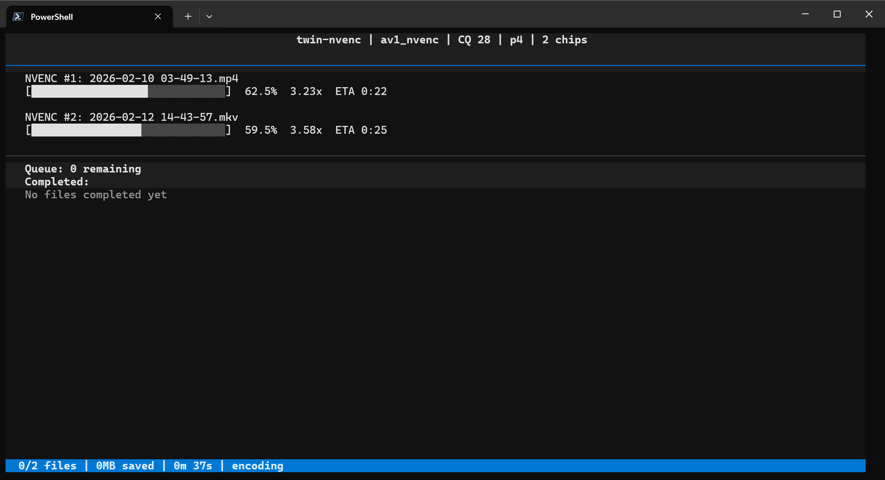

# twin-nvenc

Batch compress video files using NVIDIA NVENC hardware encoding. The killer feature: **dual NVENC support** -- the RTX 4090 has 2 NVENC chips, and twin-nvenc encodes 2 files in parallel to use both.



## Install

```bash
git clone https://github.com/andrewle8/twin-nvenc.git
cd twin-nvenc
pip install -e .
```

Requires Python 3.11+, an NVIDIA GPU with NVENC support, and ffmpeg built with NVENC. AV1 encoding requires RTX 40-series or newer.

## Usage

```bash
# Compress all videos in a folder (AV1, CQ 28, dual NVENC)
twin-nvenc "F:/OBS Captures/My Videos"

# Multiple folders at once
twin-nvenc "F:/folder1" "F:/folder2" "F:/folder3"

# HEVC instead of AV1
twin-nvenc -c hevc_nvenc "F:/OBS Captures"

# Maximum compression (slow, good for overnight)
twin-nvenc -p p7 -q 32 "F:/OBS Captures"

# Single NVENC chip (most GPUs)
twin-nvenc -j 1 "F:/OBS Captures"

# Preview what would be encoded
twin-nvenc --dry-run "F:/OBS Captures"

# Interactive TUI dashboard with progress bars
twin-nvenc --tui "F:/OBS Captures"

# Use a named profile
twin-nvenc -P screen "F:/OBS Captures"
twin-nvenc -P archival "F:/OBS Captures"
```

## Options

| Flag | Default | Description |
|------|---------|-------------|
| `-c, --codec` | `av1_nvenc` | Encoder: `av1_nvenc`, `hevc_nvenc`, `h264_nvenc` |
| `-p, --preset` | `p4` | NVENC preset: `p1` (fastest) to `p7` (best compression) |
| `-q, --quality` | `28` | Constant quality (CQ): 0-51, higher = smaller/worse |
| `-a, --audio` | `128k` | Audio bitrate |
| `-j, --parallel` | `2` | Parallel encodes (match your NVENC chip count) |
| `-o, --output` | `compressed` | Output subdirectory name |
| `-f, --ffmpeg` | auto-detect | Path to ffmpeg binary |
| `-P, --profile` | | Use a named preset from config.toml |
| `--tui` | | Launch interactive TUI dashboard |
| `--dry-run` | | Show what would be encoded |
| `--init-config` | | Create default `~/.config/twin-nvenc/config.toml` |
| `--list-profiles` | | List available profiles |

## Profiles

Create a config file with `twin-nvenc --init-config`, then customize `~/.config/twin-nvenc/config.toml`:

```toml
[defaults]
codec = "av1_nvenc"
preset = "p4"
quality = 28
parallel = 2

[presets.screen]
quality = 26    # sharp text, lower CQ preserves detail

[presets.gaming]
quality = 32    # fast action barely compresses anyway

[presets.archival]
preset = "p7"
quality = 24    # maximum quality, slow

[presets.hevc]
codec = "hevc_nvenc"
quality = 26    # broader device compatibility

[presets.fast]
preset = "p1"
quality = 32    # fastest encode, larger files
```

CLI flags always override profile values: `twin-nvenc -P archival -q 20 "F:/videos"`

## Quality Guide

| CQ Value | Use Case |
|----------|----------|
| 20-24 | High quality, moderate compression |
| 25-28 | Balanced -- good for screen recordings with text |
| 29-32 | Aggressive -- good for archival |
| 33-38 | Maximum compression -- artifacts visible on close inspection |

## How It Works

- Scans input directories for video files (mp4, mkv, avi, mov, wmv, webm, flv)
- Encodes into a `compressed/` subfolder with optimal NVENC flags (VBR, multipass, lookahead, adaptive quantization)
- Runs N encodes in parallel -- the next file starts the instant a chip frees up
- Safe to interrupt and resume: skips files that already exist in `compressed/`
- Automatically deletes output if it's bigger than the original
- Color-coded per-file results and a final report with total space saved

## Encoding Flags

Under the hood, twin-nvenc uses tuned NVENC settings:

```
-hwaccel cuda -hwaccel_output_format cuda    # GPU-resident decode, no PCIe round-trips
-rc vbr -cq N -b:v 0                        # Constant quality (adapts to scene complexity)
-multipass fullres                           # Two-pass for better bit allocation
-rc-lookahead 32                             # 32-frame lookahead for smarter decisions
-spatial-aq 1 -temporal-aq 1                 # Adaptive quantization
-bf 3 -b_adapt 1                             # B-frames with adaptive placement
```

## NVENC Chip Count

| GPU | NVENC Chips | Recommended `-j` |
|-----|-------------|-------------------|
| RTX 4090 | 2 | 2 (default) |
| RTX 4080 | 2 | 2 |
| RTX 4070 and below | 1 | 1 |
| RTX 30-series | 1 | 1 |
| RTX 20-series | 1 | 1 |

## License

MIT
